# simless vs iOS Simulator

Each screen rendered by the iOS Simulator (iPhone 17 Pro, iOS 27.0) and by simless (the same app running natively on the Mac). The list under each pair is what `simless calibrate` found when comparing the accessibility trees: elements present on one side only, and frames that differ by more than 2 pt. Text that only renders slightly wider or narrower (same lines, same place) and elements exposed with a different role are listed as minor.

8 of 14 renders match.

## Welcome · light: ✓ matches

| iOS Simulator | simless |
|:-:|:-:|
| 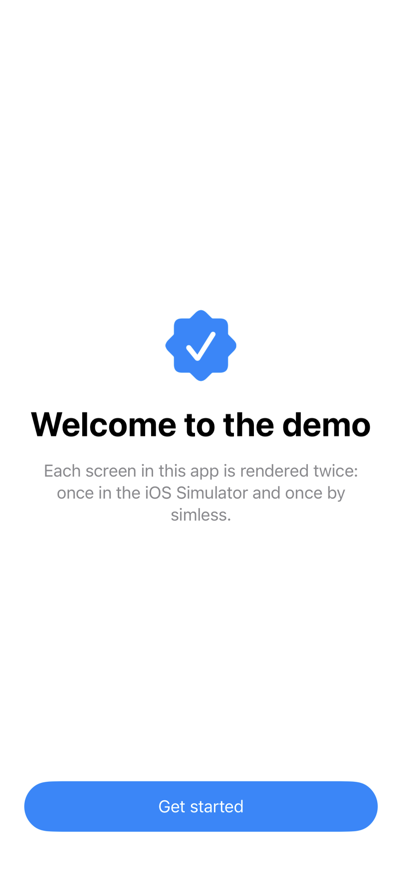 | 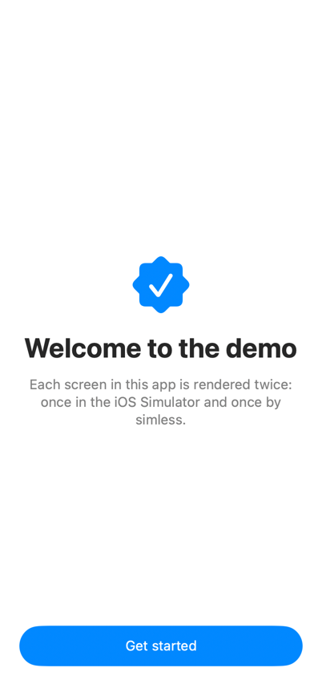 |

- 3 elements match, largest layout difference 0.5 pt
- minor: 1 text element(s) render 4% wider (same lines and positions)

## Welcome · dark: ✓ matches

| iOS Simulator | simless |
|:-:|:-:|
| 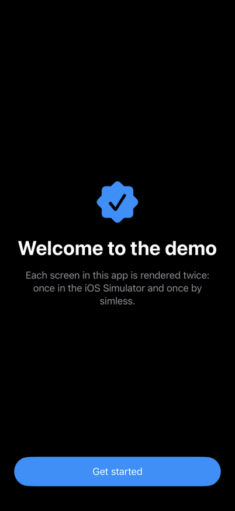 | 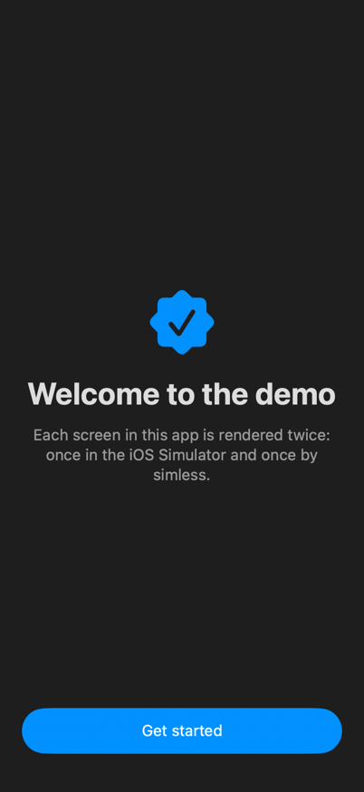 |

- 3 elements match, largest layout difference 0.5 pt
- minor: 1 text element(s) render 4% wider (same lines and positions)

## Feed · light: ✗ differs

| iOS Simulator | simless |
|:-:|:-:|
| 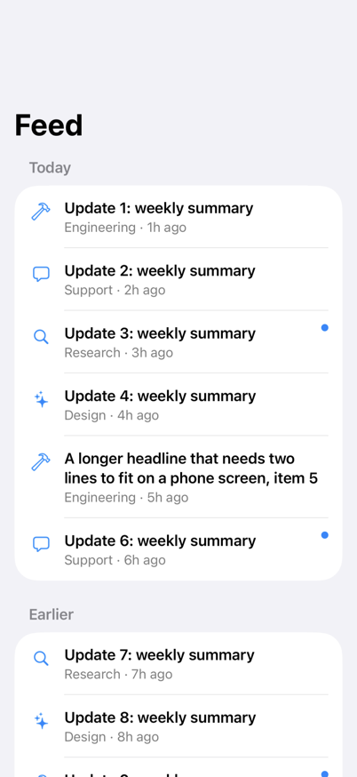 | 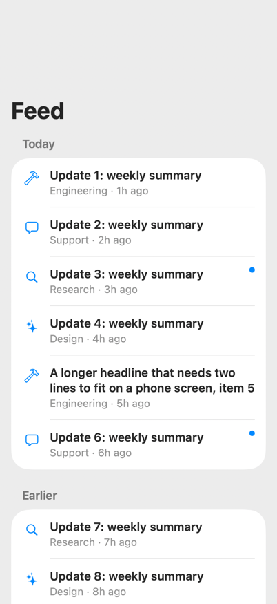 |

- text "Update 4: weekly summary, Design · 4h ago" differs by 3.0 pt: simless @16,423 370×72, simulator @16,420 370×70
- text "A longer headline that needs two lines to fit on a phone screen, item 5, Engineering · 5h ago" differs by 4.0 pt: simless @16,494 370×94, simulator @16,490 370×92
- element "Update 6: weekly summary, Support · 6h ago, Unread" differs by 5.0 pt: simless @16,588 370×72, simulator @16,583 370×70
- text "Update 7: weekly summary, Research · 7h ago" differs by 6.0 pt: simless @16,718 370×72, simulator @16,712 370×70
- text "Update 8: weekly summary, Design · 8h ago" differs by 7.0 pt: simless @16,789 370×72, simulator @16,782 370×70
- element "Update 9: weekly summary, Engineering · 9h ago, Unread" differs by 8.0 pt: simless @16,860 370×72, simulator @16,852 370×70
- header "Earlier" differs by 6.0 pt: simless @16,677 370×40, simulator @16,671 370×40

## Feed · dark: ✗ differs

| iOS Simulator | simless |
|:-:|:-:|
| 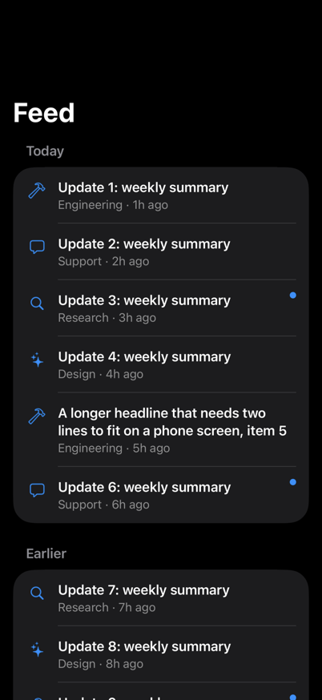 | 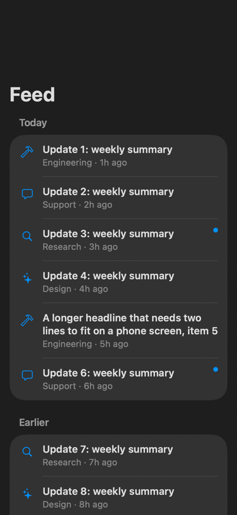 |

- text "Update 4: weekly summary, Design · 4h ago" differs by 3.0 pt: simless @16,423 370×72, simulator @16,420 370×70
- text "A longer headline that needs two lines to fit on a phone screen, item 5, Engineering · 5h ago" differs by 4.0 pt: simless @16,494 370×94, simulator @16,490 370×92
- element "Update 6: weekly summary, Support · 6h ago, Unread" differs by 5.0 pt: simless @16,588 370×72, simulator @16,583 370×70
- text "Update 7: weekly summary, Research · 7h ago" differs by 6.0 pt: simless @16,718 370×72, simulator @16,712 370×70
- text "Update 8: weekly summary, Design · 8h ago" differs by 7.0 pt: simless @16,789 370×72, simulator @16,782 370×70
- element "Update 9: weekly summary, Engineering · 9h ago, Unread" differs by 8.0 pt: simless @16,860 370×72, simulator @16,852 370×70
- header "Earlier" differs by 6.0 pt: simless @16,677 370×40, simulator @16,671 370×40

## Article · light: ✓ matches

| iOS Simulator | simless |
|:-:|:-:|
| 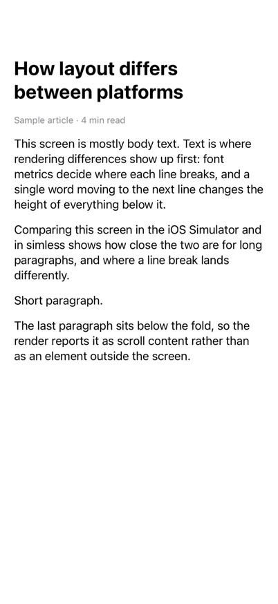 | 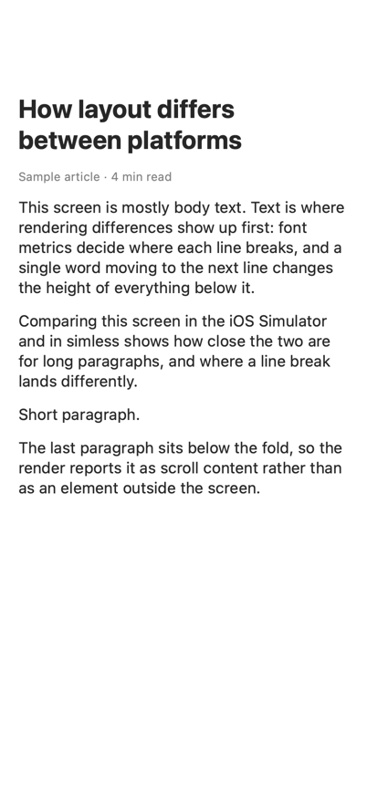 |

- 6 elements match, largest layout difference 0.5 pt
- minor: 4 text element(s) render 2% wider (same lines and positions)

## Article · dark: ✓ matches

| iOS Simulator | simless |
|:-:|:-:|
| 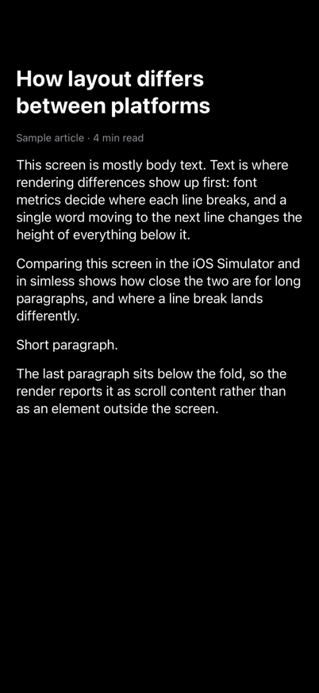 | 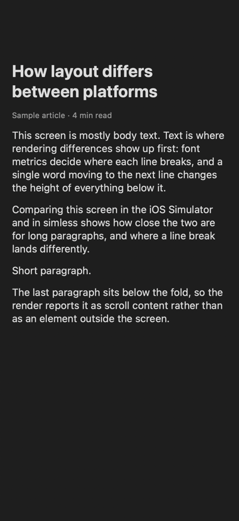 |

- 6 elements match, largest layout difference 0.5 pt
- minor: 4 text element(s) render 2% wider (same lines and positions)

## Settings · light: ✗ differs

| iOS Simulator | simless |
|:-:|:-:|
| 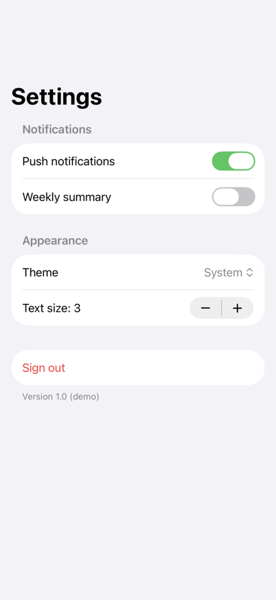 | 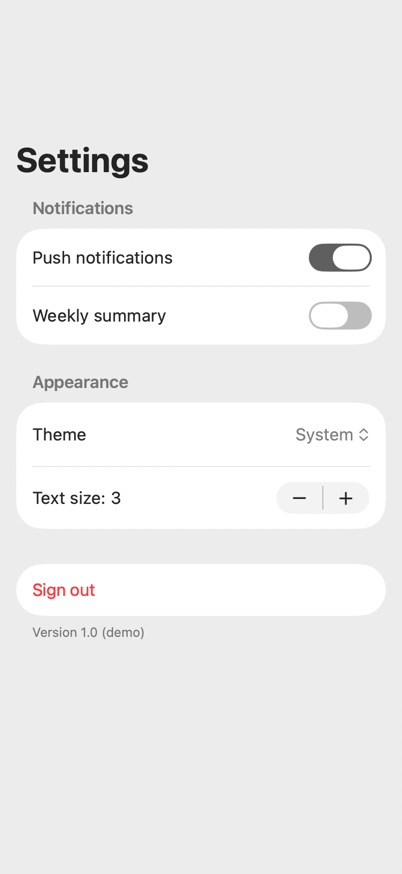 |

- button "Push notifications" differs by 6.0 pt: simless @16,208 370×58, simulator @16,208 370×52
- button "Weekly summary" differs by 6.0 pt: simless @16,266 370×58, simulator @16,260 370×52
- button "Theme, System" differs by 18.0 pt: simless @32,398 338×34, simulator @32,380 338×34
- button "Text size: 3, Decrement" differs by 29.5 pt: simless @276,462 47×32, simulator @276,432 47×32
- button "Text size: 3, Increment" differs by 29.5 pt: simless @323,462 47×32, simulator @323,432 47×32
- button "Sign out" differs by 34.5 pt: simless @16,544 370×52, simulator @16,510 370×52
- header "Appearance" differs by 12.0 pt: simless @16,342 370×40, simulator @16,330 370×40
- text "Version 1.0 (demo)" differs by 34.5 pt: simless @16,596 370×30, simulator @16,562 370×30

## Settings · dark: ✗ differs

| iOS Simulator | simless |
|:-:|:-:|
| 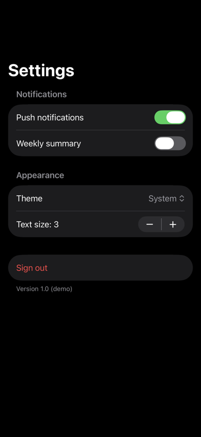 | 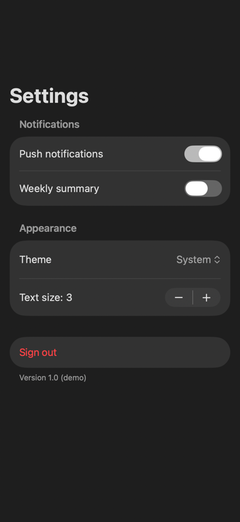 |

- button "Push notifications" differs by 6.0 pt: simless @16,208 370×58, simulator @16,208 370×52
- button "Weekly summary" differs by 6.0 pt: simless @16,266 370×58, simulator @16,260 370×52
- button "Theme, System" differs by 18.0 pt: simless @32,398 338×34, simulator @32,380 338×34
- button "Text size: 3, Decrement" differs by 29.5 pt: simless @276,462 47×32, simulator @276,432 47×32
- button "Text size: 3, Increment" differs by 29.5 pt: simless @323,462 47×32, simulator @323,432 47×32
- button "Sign out" differs by 34.5 pt: simless @16,544 370×52, simulator @16,510 370×52
- header "Appearance" differs by 12.0 pt: simless @16,342 370×40, simulator @16,330 370×40
- text "Version 1.0 (demo)" differs by 34.5 pt: simless @16,596 370×30, simulator @16,562 370×30

## Login · light: ✓ matches

| iOS Simulator | simless |
|:-:|:-:|
| 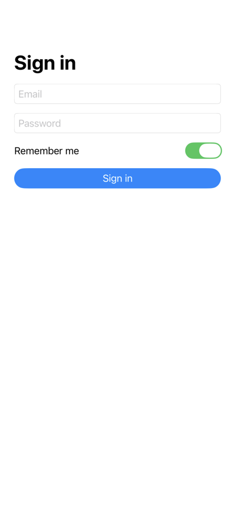 | 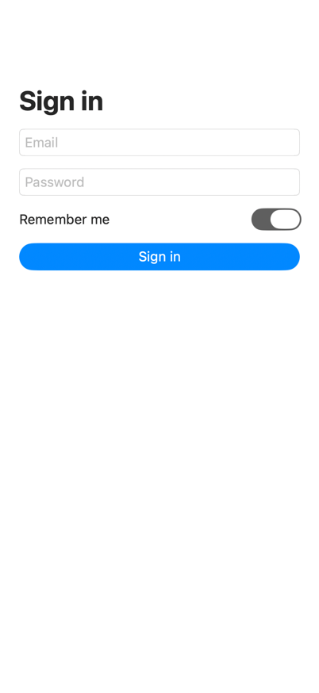 |

- 5 elements match, largest layout difference 0.5 pt

## Login · dark: ✓ matches

| iOS Simulator | simless |
|:-:|:-:|
| 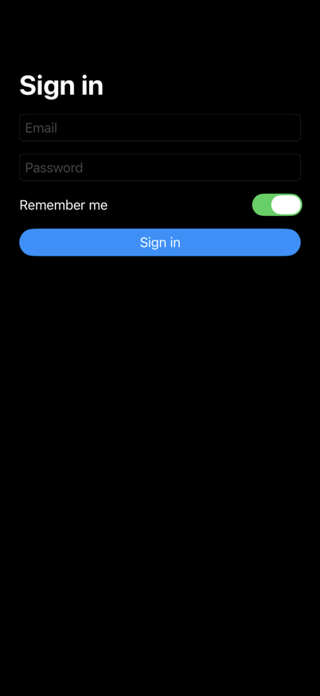 | 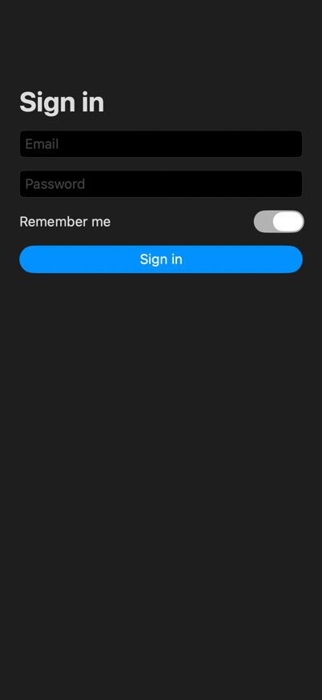 |

- 5 elements match, largest layout difference 0.5 pt

## Login.error · light: ✓ matches

| iOS Simulator | simless |
|:-:|:-:|
| 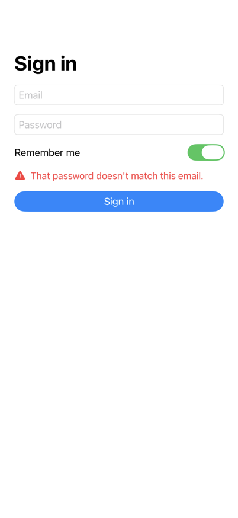 | 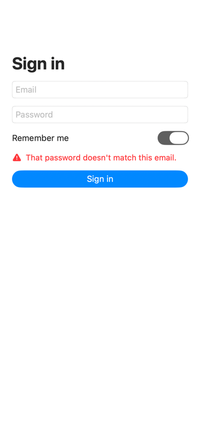 |

- 6 elements match, largest layout difference 1.0 pt
- minor: 1 text element(s) render 4% wider (same lines and positions)

## Login.error · dark: ✓ matches

| iOS Simulator | simless |
|:-:|:-:|
| 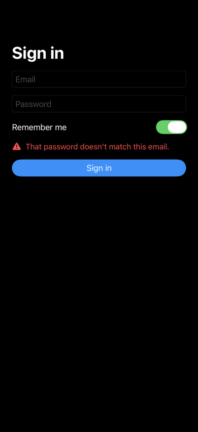 | 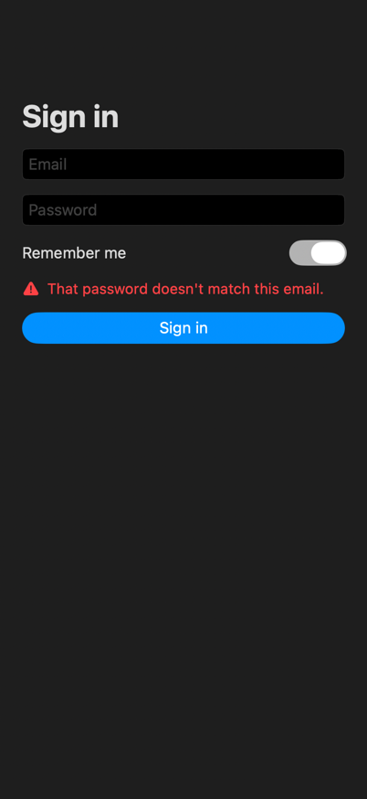 |

- 6 elements match, largest layout difference 1.0 pt
- minor: 1 text element(s) render 4% wider (same lines and positions)

## Profile · light: ✗ differs

| iOS Simulator | simless |
|:-:|:-:|
| 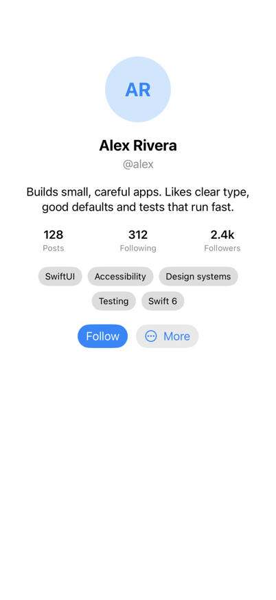 | 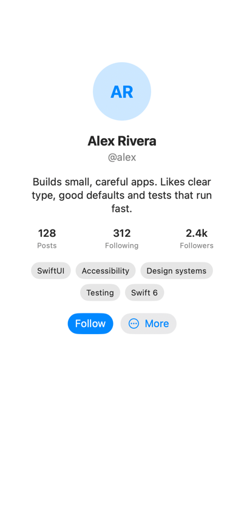 |

- text "Builds small, careful apps. Likes clear type, good defaults and tests that run fast." differs by 28.0 pt: simless @50,268 302×64, simulator @36,269 330×42
- text "128, Posts" differs by 21.5 pt: simless @61,353 33×38, simulator @62,332 32×37
- text "312, Following" differs by 21.5 pt: simless @173,353 56×38, simulator @174,332 54×37
- text "2.4k, Followers" differs by 21.5 pt: simless @296,353 56×38, simulator @297,332 54×37
- text "SwiftUI" differs by 22.0 pt: simless @61,416 46×16, simulator @65,394 44×16
- text "Accessibility" differs by 22.0 pt: simless @134,416 79×16, simulator @137,394 76×16
- text "Design systems" differs by 22.0 pt: simless @242,416 100×16, simulator @241,394 96×16
- text "Testing" differs by 22.0 pt: simless @142,452 46×16, simulator @144,430 44×16
- text "Swift 6" differs by 22.0 pt: simless @216,452 44×16, simulator @216,430 42×16
- button "Follow" differs by 22.0 pt: simless @112,494 75×34, simulator @113,472 73×34
- only in simless: button (no label)
- only in simulator: button "More"

## Profile · dark: ✗ differs

| iOS Simulator | simless |
|:-:|:-:|
| 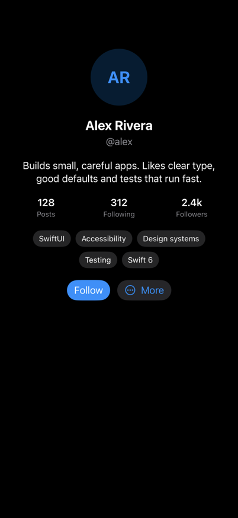 | 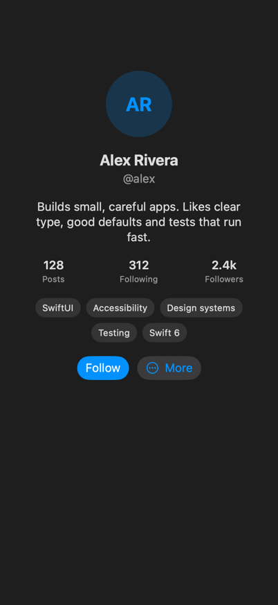 |

- text "Builds small, careful apps. Likes clear type, good defaults and tests that run fast." differs by 28.0 pt: simless @50,268 302×64, simulator @36,269 330×42
- text "128, Posts" differs by 21.5 pt: simless @61,353 33×38, simulator @62,332 32×37
- text "312, Following" differs by 21.5 pt: simless @173,353 56×38, simulator @174,332 54×37
- text "2.4k, Followers" differs by 21.5 pt: simless @296,353 56×38, simulator @297,332 54×37
- text "SwiftUI" differs by 22.0 pt: simless @61,416 46×16, simulator @65,394 44×16
- text "Accessibility" differs by 22.0 pt: simless @134,416 79×16, simulator @137,394 76×16
- text "Design systems" differs by 22.0 pt: simless @242,416 100×16, simulator @241,394 96×16
- text "Testing" differs by 22.0 pt: simless @142,452 46×16, simulator @144,430 44×16
- text "Swift 6" differs by 22.0 pt: simless @216,452 44×16, simulator @216,430 42×16
- button "Follow" differs by 22.0 pt: simless @112,494 75×34, simulator @113,472 73×34
- only in simless: button (no label)
- only in simulator: button "More"
